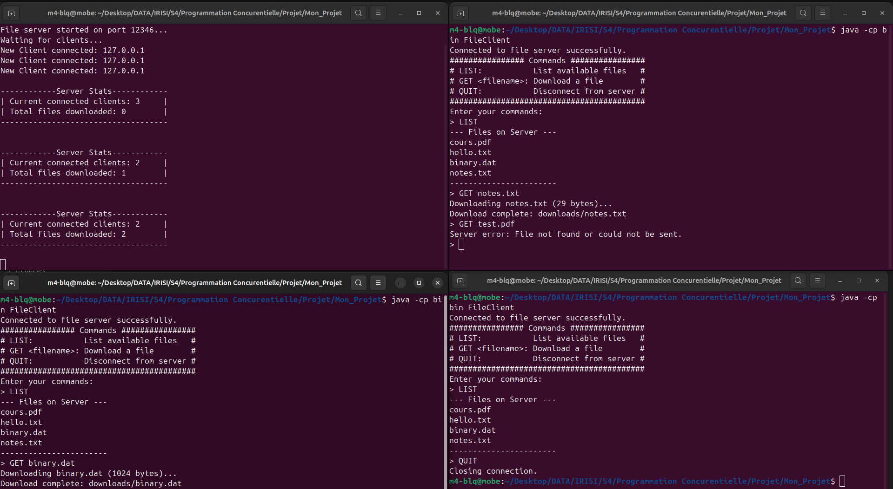

# 🚀 Multi-Threaded File Server

> A Java implementation of a multi-threaded TCP file server that allows multiple clients to connect simultaneously and download files using a simple set of commands presented in a terminal interface.

  

<a href="https://github.com/ellerbrock/open-source-badges/">
 
</a>

## Overview

This project implements a multi-threaded TCP file server in Java that allows multiple clients to connect simultaneously and request files from a shared directory. The server handles each client connection in a dedicated thread, ensuring efficient and parallel file serving.

Synchronization is achieved using the `synchronized` keyword on all shared data structures, preventing race conditions and ensuring data consistency across concurrent threads.

This project was developed as part of the **Concurrent and Network Programming** module (IRISI 2 — University Cadi Ayyad, 2025–2026). The goal was to apply fundamental concepts of concurrent programming such as threads, synchronization, and TCP socket communication to build a real distributed file-sharing application.

---

## Features

- Multiple simultaneous client connections
- Dedicated thread per client (`ClientHandler`)
- `LIST` command — list all available files on the server
- `GET <filename>` command — download any file (text or binary)
- `QUIT` command — cleanly disconnect from the server
- Synchronized shared state (connected clients, operation log, download counter)
- Automatic server statistics printed every 20 seconds
- Graceful handling of abrupt client disconnections
- Multi-client test class to simulate a concurrent load

## Project Structure

```
MultiThreaded-File-Server/
├── src/
│   ├── FileServer.java        # Main server — listens on port 12346
│   ├── ClientHandler.java     # Handles one client per thread
│   ├── FileClient.java        # Console client application
│   ├── SharedState.java       # Synchronized shared resources
│   └── MultiClientTest.java   # Concurrent load test (3 clients)
├── shared/                    # Files available for download
│   ├── notes.txt
│   ├── hello.txt
│   ├── cours.pdf
│   └── binary.dat
├── downloads/                 # Files downloaded by the client
└── README.md
```

## How It Works

The server listens on **port 12346** using a `ServerSocket`. For each incoming connection, a new `Thread` running a `ClientHandler` instance is created. All threads share a single `SharedState` object, which tracks connected clients, logs operations, and counts downloads — all protected with `synchronized` methods.

### Communication Protocol

| Command | Description | Server Response |
|---|---|---|
| `LIST` | Request the list of available files | File names, one per line |
| `GET <filename>` | Download a file | File size (long) + raw bytes |
| `QUIT` | Disconnect cleanly | Connection closed |

### Architecture


## Getting Started

### Prerequisites

- Java 11 or higher
- IntelliJ IDEA (recommended) or any Java IDE

1. **Clone the repository:**

```bash
git clone https://github.com/m-belefqih/MultiThreaded-File-Server.git
cd MultiThreaded-File-Server
```

2. **Run the Server**

```bash
# Compile
javac -d out/production/MultiThreaded-File-Server/*.java
 
# Start the server
java -cp out/production/MultiThreaded-File-Server FileServer
```

Expected output:
```
File server started on port 12346...
Waiting for clients...
```

3. **Run a Client**

Open a new terminal and run:

```bash
java -cp out/production/MultiThreaded-File-Server FileClient
```

Expected output:
```
Connected to file server successfully.
################ Commands ################
# LIST:           List available files   #
# GET <filename>: Download a file        #
# QUIT:           Disconnect from server #
##########################################
Enter your commands:
>
```

### Example Session

```
> LIST
--- Files on Server ---
notes.txt
hello.txt
cours.pdf
binary.dat
-----------------------
 
> GET cours.pdf
Downloading cours.pdf (102400 bytes)...
Download complete: downloads/cours.pdf
 
> QUIT
Closing connection.
```

## 📸 Demo — 3 Simultaneous Clients

The screenshot below shows the system running with **1 server + 3 clients**
connected simultaneously, demonstrating concurrent file downloads and real-time
server statistics.



**What the screenshot shows:**
- **Top-left** — Server console: 3 clients connected, live stats updated automatically
- **Top-right** — Client 1: `LIST` → `GET notes.txt` ✅ → `GET test.pdf` ❌ (not found)
- **Bottom-left** — Client 2: `LIST` → `GET binary.dat` ✅
- **Bottom-right** — Client 3: `LIST` → `QUIT` ✅
